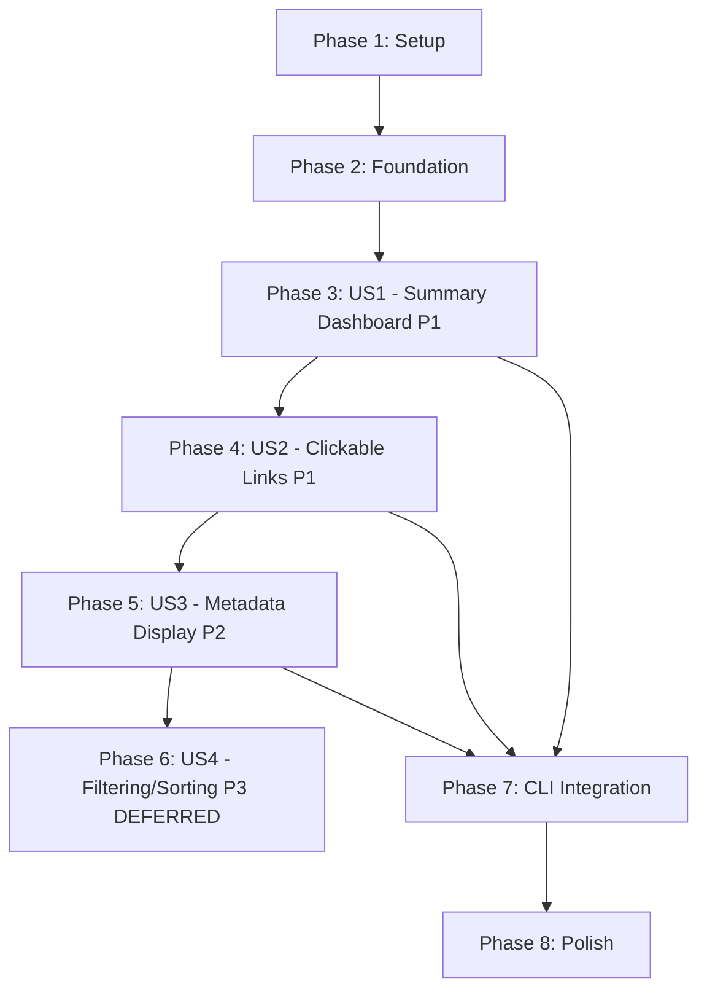

# Tasks: Aggregated Test Reports for Multi-Scenario Runs

**Input**: Design documents from `/specs/004-aggregated-test-reports/`
**Prerequisites**: plan.md, spec.md, research.md, data-model.md, contracts/, quickstart.md

**Tests**: No test tasks generated - feature specification does not explicitly request TDD approach. Manual testing and integration testing described in quickstart.md.

**Organization**: Tasks are grouped by user story to enable independent implementation and testing of each story.

## Format: `[ID] [P?] [Story] Description`

- **[P]**: Can run in parallel (different files, no dependencies)
- **[Story]**: Which user story this task belongs to (e.g., US1, US2, US3)
- Include exact file paths in descriptions

## Path Conventions

- **Single project**: `src/mcp_eval/`, `tests/unit/` at repository root
- This is a single Python CLI application

---

## Phase 1: Setup (Shared Infrastructure)

**Purpose**: Create data models that will be used across all user stories

- [X] T001 Create data models file `src/mcp_eval/summary_models.py` with ScenarioStatus enum, ScenarioExecutionSummary, and TestRunSummary models per data-model.md
- [X] T002 Add Pydantic validators to TestRunSummary for count validation (passed + failed + recorded + error == total_scenarios)
- [X] T003 [P] Add `pass_rate` and `total_duration` properties to TestRunSummary model
- [X] T004 [P] Import summary models in `src/mcp_eval/__init__.py` for package-level access

**Checkpoint**: Data models created and importable - ready for HTML generation and CLI integration

---

## Phase 2: Foundational (Blocking Prerequisites)

**Purpose**: Core HTML generation infrastructure that user stories will build upon

**⚠️ CRITICAL**: No user story work can begin until this phase is complete

- [X] T005 Create `generate_summary_report()` function skeleton in `src/mcp_eval/html_reporter.py` accepting TestRunSummary parameter
- [X] T006 [P] Add helper function `_get_status_color(status: ScenarioStatus) -> str` to html_reporter.py returning Bootstrap color hex values per research.md
- [X] T007 [P] Add helper function `_truncate_intent(intent: str, max_length: int = 60) -> tuple[str, str]` returning (display_text, full_text) for tooltips
- [X] T008 [P] Add helper function `_format_duration(seconds: float) -> str` returning "X.Xs" format
- [X] T009 [P] Add helper function `_format_similarity(score: Optional[float]) -> str` returning "0.XX" or "N/A"

**Checkpoint**: Foundation ready - user story implementation can now begin in parallel

---

## Phase 3: User Story 1 - View Test Suite Summary Dashboard (Priority: P1) 🎯 MVP

**Goal**: Generate HTML summary report with total counts header and scenario table showing basic status for each scenario

**Independent Test**: Run `source .env && uv run mcp-eval test --scenarios-dir scenarios/tool_management/` and verify `reports/test_summary_TIMESTAMP.html` is generated, contains header with "X passed, Y failed, Z recorded" counts, and table with one row per scenario showing status badges in correct colors (green/red/blue/yellow)

### Implementation for User Story 1

- [ ] T010 [P] [US1] Implement HTML `<head>` section in generate_summary_report() with DOCTYPE, charset UTF-8, viewport meta tag, and title per contracts/summary-report-html.md
- [ ] T011 [P] [US1] Embed CSS styles in `<style>` tag including color palette CSS variables (--color-passed, --color-failed, --color-recorded, --color-error) per research.md
- [ ] T012 [US1] Implement `<header>` section with h1 title and summary-stats div showing total/passed/failed/recorded counts from test_run parameter
- [ ] T013 [US1] Add conditional ERROR stat span to header that only displays if error_count > 0
- [ ] T014 [US1] Add metadata div to header showing test_run_timestamp (ISO-8601), git_hash (if present), and mcp_config_path (if present)
- [ ] T015 [US1] Implement `<table>` structure in `<main>` with thead containing column headers: Scenario, Intent, Status, Tools, Duration, Score
- [ ] T016 [US1] Implement tbody generation loop iterating over test_run.scenario_summaries creating one `<tr>` per scenario
- [ ] T017 [US1] Implement status badge rendering in table cells using `<span class="badge status-{lowercase}">` with status enum value text
- [ ] T018 [US1] Add CSS classes for table styling including .scenarios-table, thead background color #f8f9fa, hover states per contracts/summary-report-html.md
- [ ] T019 [US1] Add CSS classes for status badges (.status-passed, .status-failed, .status-recorded, .status-error) with correct background colors
- [ ] T020 [US1] Add `<footer>` with "Generated by mcp-eval v{VERSION}" text
- [ ] T021 [US1] Return complete HTML string from generate_summary_report() function

**Checkpoint**: At this point, User Story 1 should be fully functional - summary HTML generated with counts and basic status table

---

## Phase 4: User Story 2 - Navigate to Individual Scenario Details (Priority: P1)

**Goal**: Make scenario names clickable hyperlinks pointing to detailed HTML reports using relative file paths

**Independent Test**: Open generated summary report, click any scenario name link, verify browser navigates to corresponding detailed report HTML file (e.g., `add_simple_server_baseline_20251111_143147.html`)

### Implementation for User Story 2

- [X] T022 [US2] Modify scenario name table cell generation to wrap scenario_path text in `<a href="{detailed_report_path}">` anchor tag using relative path from ScenarioExecutionSummary.detailed_report_path field
- [X] T023 [US2] Add CSS styling for scenario name links including color, hover underline, and cursor pointer

**Checkpoint**: At this point, User Stories 1 AND 2 should both work independently - summary report has clickable navigation to detailed reports

---

## Phase 5: User Story 3 - View Scenario Metadata in Summary (Priority: P2)

**Goal**: Display comprehensive scenario metadata in table: full path, truncated intent with tooltip, tool count, duration, and similarity score

**Independent Test**: Generate summary report with varied scenarios, verify table displays: scenario paths with subdirectories (e.g., "tool_management/add_simple_server"), intents truncated at 60 chars with "..." and full text in title attribute tooltip, tool counts as integers, durations formatted as "X.Xs", similarity scores as "0.XX" or "N/A"

### Implementation for User Story 3

- [X] T024 [US3] Implement intent column rendering using _truncate_intent() helper - display truncated text with full intent in title attribute for tooltip
- [X] T025 [P] [US3] Implement tool count column rendering displaying scenario.tool_count as integer with no formatting
- [X] T026 [P] [US3] Implement duration column rendering using _format_duration() helper to format scenario.duration_seconds as "X.Xs"
- [X] T027 [P] [US3] Implement similarity score column rendering using _format_similarity() helper handling Optional[float] - show "N/A" for None values
- [X] T028 [US3] Add CSS class .intent with max-width 300px, overflow hidden, text-overflow ellipsis, and white-space nowrap for truncation styling
- [X] T029 [US3] Add overflow-x auto to main element wrapper for responsive horizontal scrolling on narrow viewports

**Checkpoint**: All P1 and P2 user stories now complete - summary report displays comprehensive scenario metadata with proper formatting

---

## Phase 6: User Story 4 - Filter and Sort Scenarios (Priority: P3) ⚠️ DEFERRED

**Goal**: Add client-side JavaScript for filtering by status checkboxes and sorting by column headers

**Independent Test**: Open summary report with 20+ scenarios, click "Show only failed" filter checkbox and verify only failed scenarios display, click "Duration" column header and verify scenarios sorted by execution time

**Note**: Per research.md decision, P3 implementation deferred to separate task/feature. P1/P2 deliver core value without JavaScript dependency. When implementing P3, use vanilla JavaScript embedded in HTML (no external .js files), follow progressive enhancement pattern.

### Implementation for User Story 4 (DEFERRED)

- [ ] T030 [US4] Add filter control checkboxes to header for each status type (Passed, Failed, Recorded, Error) with click event listeners
- [ ] T031 [US4] Implement JavaScript toggleRowVisibility() function to show/hide table rows based on checked filters
- [ ] T032 [US4] Add sortable column headers with click event listeners for Scenario, Tools, Duration columns
- [ ] T033 [US4] Implement JavaScript sortTable(columnIndex) function using Array.sort() to reorder tbody rows
- [ ] T034 [US4] Add CSS classes for sorted column headers showing sort direction indicators (▲/▼)
- [ ] T035 [US4] Embed JavaScript in `<script>` tag at end of `<body>` ensuring HTML remains functional without JS (progressive enhancement)

**Checkpoint**: All user stories including P3 now complete - summary report has full filtering and sorting capabilities

---

## Phase 7: CLI Integration

**Purpose**: Integrate summary report generation into existing test/batch CLI commands

- [ ] T036 Import summary models in `src/mcp_eval/cli.py`: `from mcp_eval.summary_models import ScenarioExecutionSummary, TestRunSummary, ScenarioStatus`
- [ ] T037 Add `get_git_hash() -> Optional[str]` helper function to cli.py using subprocess to run `git rev-parse --short=8 HEAD`
- [ ] T038 Modify `test()` command to initialize empty list `scenario_summaries: List[ScenarioExecutionSummary] = []` and `run_start_time = datetime.now()` at function start
- [ ] T039 Modify `test()` command scenario execution loop to create ScenarioExecutionSummary after each scenario completes and append to scenario_summaries list
- [ ] T040 Add TestRunSummary creation at end of `test()` command calculating aggregate counts (passed_count, failed_count, recorded_count, error_count) from scenario_summaries
- [ ] T041 Call `generate_summary_report(test_run)` at end of `test()` command and write returned HTML to `reports/test_summary_{timestamp}.html`
- [ ] T042 Add console output printing summary report file path using rich console: `console.print(f"\n📊 [green]Summary report:[/green] {summary_path}")`
- [ ] T043 Repeat tasks T038-T042 for `batch()` command to ensure both commands generate summary reports
- [ ] T044 [P] Update CLI help text for `test()` and `batch()` commands documenting that summary reports are generated listing all scenario results

**Checkpoint**: CLI integration complete - running `mcp-eval test` or `mcp-eval batch` with multiple scenarios automatically generates summary report

---

## Phase 8: Polish & Cross-Cutting Concerns

**Purpose**: Documentation, validation, and final touches

- [ ] T045 [P] Update `CLAUDE.md` "Output Files" section documenting new `test_summary_TIMESTAMP.html` file format and contents
- [ ] T046 [P] Update README.md (if exists) with example showing multi-scenario testing workflow and summary report output
- [ ] T047 [P] Add docstrings to generate_summary_report() and all helper functions in html_reporter.py with parameter types and return value descriptions
- [ ] T048 [P] Add type hints to all new functions ensuring mypy/pyright compatibility
- [ ] T049 Manual testing: Run `mcp-eval test --scenarios-dir scenarios/` with 10+ scenarios covering all status types (PASSED, FAILED, RECORDED, ERROR)
- [ ] T050 Manual testing: Open generated summary HTML in Chrome, Firefox, and Safari browsers verifying rendering consistency and link navigation
- [ ] T051 Manual testing: Test responsive behavior by resizing browser window to mobile viewport width (375px) and verify horizontal scrolling works
- [ ] T052 Manual testing: Verify intent tooltips display on hover for truncated intents >60 characters
- [ ] T053 Code review: Verify all CSS color values match research.md specifications (#28a745 green, #dc3545 red, #007bff blue, #ffc107 yellow)
- [ ] T054 Code review: Verify all relative file paths used in hyperlinks (no absolute paths that break portability)
- [ ] T055 Code review: Verify HTML output validates against W3C HTML5 validator
- [ ] T056 [P] Add inline code comments explaining key sections: status badge rendering, intent truncation, count validation

**Checkpoint**: Feature complete, documented, and validated - ready for pull request

---

## Dependencies & Execution Strategy

### User Story Dependencies



**Critical Path**: Setup → Foundation → US1 → US2 → US3 → CLI Integration → Polish

**Independent Stories**:
- US1, US2, US3 build on each other (sequential dependency)
- US4 (P3) is independent enhancement, can be implemented separately later
- CLI Integration depends on US1-US3 completion but can proceed once US3 done

### Parallel Execution Opportunities

**Phase 1 (Setup)**:
- T003 and T004 can run in parallel after T001-T002 complete

**Phase 2 (Foundation)**:
- T006, T007, T008, T009 can all run in parallel after T005 completes (different helper functions)

**Phase 3 (US1)**:
- T010, T011, T018, T019 can run in parallel (HTML structure and CSS styling are independent)
- T012, T013, T014 can run in parallel after T010-T011 (different header sections)

**Phase 5 (US3)**:
- T025, T026, T027, T028 can run in parallel (independent column renderings)

**Phase 7 (CLI Integration)**:
- T037, T044 can run in parallel with sequential tasks (helper function and docs independent)

**Phase 8 (Polish)**:
- T045, T046, T047, T048, T053, T054, T055, T056 can all run in parallel (documentation and validation)
- T049-T052 are manual testing tasks that can run in parallel

### Example Parallel Execution Per Phase

**Phase 2 Example** (4 helpers in parallel):
```bash
# Terminal 1
task T006: implement _get_status_color()

# Terminal 2
task T007: implement _truncate_intent()

# Terminal 3
task T008: implement _format_duration()

# Terminal 4
task T009: implement _format_similarity()
```

**Phase 3 Example** (HTML structure and CSS in parallel):
```bash
# Terminal 1
tasks T010-T017: implement HTML structure

# Terminal 2
tasks T018-T019: implement CSS styles
```

**Phase 8 Example** (docs and validation in parallel):
```bash
# Terminal 1
task T045: update CLAUDE.md

# Terminal 2
task T046: update README.md

# Terminal 3
task T047-T048: add docstrings and type hints

# Terminal 4
task T053-T056: code review and validation checks
```

---

## Implementation Strategy

### MVP Scope (Recommended First PR)

**Include**: Phases 1-5 + Phase 7 (Setup, Foundation, US1, US2, US3, CLI Integration)

**Deliverables**:
- ✅ Summary HTML report with counts header
- ✅ Clickable scenario links to detailed reports
- ✅ Comprehensive metadata display (intent, tools, duration, similarity)
- ✅ CLI integration in test and batch commands
- ✅ Core value delivered for P1 and P2 user stories

**Exclude**: Phase 6 (US4 - Filtering/Sorting P3)

**Rationale**: US1-US3 deliver 90% of value with simpler implementation. US4 (JavaScript filtering) adds complexity and can be separate enhancement.

### Incremental Delivery

1. **Sprint 1** (P1): Phases 1-4 → Basic summary with clickable links (US1 + US2)
2. **Sprint 2** (P2): Phase 5 + Phase 7 → Add metadata display and CLI integration (US3)
3. **Sprint 3** (Polish): Phase 8 → Documentation and validation
4. **Future Sprint** (P3): Phase 6 → Add filtering/sorting enhancement (US4)

### Testing Strategy

**Unit Testing**: Per feature spec, no explicit TDD request, so no unit test tasks generated. However, quickstart.md provides manual testing checklist.

**Integration Testing**: Manual testing tasks in Phase 8 (T049-T052) cover end-to-end scenarios:
- Multi-scenario test runs with all status types
- Cross-browser HTML rendering validation
- Responsive design testing
- Link navigation verification

**Validation**: Code review tasks (T053-T056) ensure:
- CSS color specifications correct
- Relative paths used throughout
- HTML5 validation passes
- Code properly documented

---

## Task Summary

**Total Tasks**: 56 tasks
- Phase 1 (Setup): 4 tasks
- Phase 2 (Foundation): 5 tasks
- Phase 3 (US1 - P1): 12 tasks
- Phase 4 (US2 - P1): 2 tasks
- Phase 5 (US3 - P2): 6 tasks
- Phase 6 (US4 - P3 DEFERRED): 6 tasks
- Phase 7 (CLI Integration): 9 tasks
- Phase 8 (Polish): 12 tasks

**Parallelizable Tasks**: 23 tasks marked with [P] can run in parallel
**User Story Tasks**: 26 tasks marked with [US1-US4] belong to specific user stories

**MVP Task Count** (Phases 1-5, 7-8 excluding Phase 6): 50 tasks
**Estimated Implementation Time**: 3-4 hours for MVP (per quickstart.md), additional 1-2 hours for P3 when ready

**Format Validation**: ✅ All tasks follow required format: `- [ ] [TaskID] [P?] [Story?] Description with file path`
